# CoParent Logic ML Service

CoParent Logic ML Service is a FastAPI-based microservice that powers the AI side of the Blue Sky Family (CoParent Logic) product.
It hosts the product's two analysis engines and reports results back to the core app via **Convex webhooks**.

- [**Engine 1 — PlanGuard**](#engine-1--planguard) analyzes a parenting plan across 13 domains, producing cited, per-issue findings with rewrite suggestions.
-  [**Engine 2 — Communication Pattern Analysis**](#engine-2--communication-pattern-analysis) analyzes co-parent message logs for tone, escalation, and conflict patterns. 

The ML service does **not** talk directly to Convex or any database; instead, it:

- Receives input (signed URL to a plan or message log) + case profile from the core app.
- Runs ingestion + AI analysis in the background.
- Reports progress and results back to the core app via **webhooks**.

---

## High-level Architecture

- **API Service** (`app/main_api.py`)
  - FastAPI app served by Gunicorn + Uvicorn.
  - Exposes REST endpoints under `/api/v1`.
  - Enqueues work as a background task — returns `202 Accepted` immediately.

- **Core Logic** (`app/core`)
  - **Engine 1 (PlanGuard):** 13 domain analyzers (one reusable agent, driven by 13 domain specs) + `PlanAnalysisService`.
  - **Engine 2 (Communication Analysis):** pattern analyzers over the C/P-series taxonomy + `CommunicationAnalysisService`. *(Planned.)*
  - Shared domain enums: `app/core/domain/enums.py`.
  - Agent output schemas: `app/core/agents/schemas/`.
  - Dependency wiring via `app/core/dependencies.py`.

- **Infrastructure** (`app/infrastructure`)
  - `azure/openai_client.py`: Azure OpenAI client for LLM analysis.
  - `ocr/ocr_client.py`: OCR for scanned PDFs (Tesseract for v1; Azure Document Intelligence when the client's Azure account is ready).
  - `pii/redactor.py`: PII redaction (Presidio, local — no external account).
  - `convex/webhook_client.py`: Webhook client for Convex callbacks.

- **Webhooks**
  - Status updates, analysis success, and failures. URLs configured via env (`WEBHOOK_URL_*`).

Both engines share the same skeleton (ingestion → PII redaction → parallel LLM analysis → assemble → webhook). They differ in input (plan document vs message log), taxonomy, and prompts.

---

# Engine 1 — PlanGuard

Analyzes a parenting plan across **13 analysis domains**, producing cited, per-issue findings with rewrite suggestions.

## Workflow

```mermaid
graph TD
 subgraph S0["S0: Ingest"]
    direction TB
        Extract["Text Extract-Tesseract "]
        Structurer["Extraction Structure"]
        PII["PII redaction - Presidio"]
  end
 subgraph S1["S1: Per-domain analysis - parallel"]
    direction TB
        Findings["per-domain findings"]
        Analysis["13 domains via asyncio.gather"]
  end
 subgraph S2["S2:Deterministic rule pass"]
    direction TB
        Rules["Loophole lexicon + gap checks, overlap merge"]
  end
 subgraph S3["S3: Criteria scoring"]
    direction TB
        Scoring["LLM scores 5 criteria, overall = average"]
  end
 subgraph S4["S4: Assemble Analysis JSON"]
    direction TB
        Assemble["Assemble Analysis JSON + version stamp"]
  end
    Start(("Start")) --> Upload["UPLOADING"]
    Upload --File saved to Convex--> Trigger("Trigger ML Service")
    Trigger --> Extract
    Extract --Raw Text--> Structurer
    Structurer --Structured JSON--> PII
    PII --WEBHOOK_DOCUMENT_PROCESSED--> Analysis
    Analysis -- "Azure OpenAI, temp=0" --> Findings
    Findings --schema output--> Rules
    Rules --schema output--> Scoring
    Scoring --schema output--> S4
    S4 -- WEBHOOK_ANALYSIS_SUCCESS --> Review["USER REVIEW"]
    Review --> Done["COMPLETED"]


     Extract:::asyncJob
     Structurer:::asyncJob
     PII:::asyncJob
     Analysis:::asyncJob
     Scoring:::asyncJob
     Rules:::asyncJob
     Assemble:::asyncJob
     Upload:::userAction
     Review:::userAction
     Done:::success
    %% Define Styles
    classDef userAction fill: #1a252f, color: #fff, stroke: #000, stroke-width: 2px;
    classDef asyncJob fill: #d35400, color: #fff, stroke: #a04000, stroke-width: 2px;
    classDef logic fill: #34495e, color: #fff, stroke: #2c3e50, stroke-width: 2px;
    classDef failure fill: #c0392b, color: #fff, stroke: #922b21, stroke-width: 2px;
    classDef success fill: #27ae60, color: #fff, stroke: #1e8449, stroke-width: 2px;
```



## Pipeline (v1 = S0 + S1)

### S0 — Ingest
1. **Status → PROCESSING** (webhook).
2. **Download** the plan from the signed URL.
3. **Extract text**: Word / searchable PDF → read directly (no OCR). Scanned PDF → OCR (Tesseract for v1; Azure Document Intelligence once the client's Azure account is provisioned).
4. **Normalize + section structure** (pure Python): clean text, preserve section/clause numbering — makes findings citable.
5. **PII redaction** (Presidio, local): redact minor-child identifiers before any LLM call; store `pii_map` for UI re-hydration.
6. **Metadata**: `document_id` / `case_id`, `usedPriorData: false` (stateless per document).

### S1 — Per-domain analysis (v1 deliverable)
1. **Status → ANALYZING** (webhook).
2. **13 domains in parallel** (`asyncio.gather`). One reusable analyzer agent driven by each domain's spec (definition + what-good-looks-like + flags + few-shot).
3. Each call: **Azure OpenAI, temperature 0, schema-enforced JSON**, conditioned on `case_profile` (esp. parenting model).
4. Each domain returns **per-issue findings**:
   ```json
   {
     "id": "d04",
     "title": "Communication Protocols",
     "findings": [
       {
         "type": "risky",
         "issue": "'reasonable and timely' communication is undefined",
         "source": { "section": "IV(A)", "quote": "reasonable and timely manner" },
         "severity": "medium",
         "suggested_fix": "Define a response window, e.g. 'within 48 hours via the designated platform.'"
       }
     ],
     "clear": [ { "note": "Emergency phone contact is permitted.", "source": { "section": "IV(D)" } } ]
   }
   ```
5. **Citation:** Azure OpenAI (GPT) has no native citations API, so the prompt instructs the model to return the exact quoted span + section; a deterministic code step matches it back to the source and guards against hallucinated references.

### S2 — Deterministic rule pass (phase 2)
Loophole lexicon (Top-50 phrases) + gap-taxonomy checks in pure Python; fuse with S1; surface overlaps where multiple domains cite the same section.

### S3 — Criteria scoring (phase 2)
The LLM scores the **5 plan-level criteria** (0–100) from the findings — Clarity, Dispute Prevention, Enforceability, Completeness, Child-Centeredness (all "higher = better") — each with a rationale and the findings it's based on. **`overall` = the average of the 5 sub-scores** (code). This replaces the prototype's non-trivial formula and drops the domain↔criteria matrix. Scores are a professional-facing reference, not a court artifact, so small run-to-run variation is acceptable.

### S4 — Assemble & write back
Assemble the Analysis JSON (13 domains + version stamp + `usedPriorData:false`), then **webhook → Convex**; backend flips `analysisStatus`.

## The 13 Analysis Domains

d01 Legal Structure & Authority · d02 Parenting Time & Scheduling · d03 Decision-Making (6 sub-areas) · d04 Communication Protocols · d05 Information Sharing · d06 Child-Centered Protections · d07 Third-Party Involvement · d08 Religion & Values · d09 Conflict Prevention · d10 Compliance & Enforcement · d11 Change & Modification · d12 Safety & High-Risk · d13 Developmental Fit.

**"Best Interest Alignment" is not a 14th analysis domain** — it is the rollup layer (the 5 plan-level scores + summary), computed from d01–d13 in phase 2, not analyzed.

## PlanGuard Endpoint

- `POST /api/v1/plans/analyze` → `PlanAnalysisService.start_async_analysis(...)`
  - Request: `{ plan_url, case_profile, case_id, document_id, webhook_url }`
  - Response: `{ task_id }` (`202 Accepted`)

---

# Engine 2 — Communication Pattern Analysis *(Planned)*

Analyzes co-parent message logs for tone, escalation, gatekeeping, and other conflict patterns, using the C-series (communication) and P-series (pattern/risk) taxonomy. Same skeleton as PlanGuard — ingestion (message logs instead of documents) → PII redaction → parallel LLM analysis → message-level citations → webhook. Role-gating (attorney sees all, mediator sees a subset) applies at the presentation layer, not here. To be built after PlanGuard v1.

- `POST /api/v1/communications/analyze` *(planned)*

---

## Components Overview

### API Layer (`app/api`)
- **Routers:** `app/api/routers/v1/plans.py` (Engine 1); `communications.py` (Engine 2, planned).
- **Request schemas:** `app/api/schemas/request/` (`AnalyzeRequest`, ...).
- **Response schemas:** `app/api/schemas/response/` (`TaskAcceptedResponse`).

### Domain Layer (`app/core/domain`)
- `enums.py`: `DomainId`, `FindingType` (`clear` | `risky` | `missing`), `Severity` (`low` | `medium` | `high`), `WorkflowStatus`.

### Core Agents (`app/core/agents`)
- `domain_analyzer/` → `DomainAnalyzerAgent` (reusable, run per domain spec).
- `domain_specs/` → 13 domain specs (definition, what-good-looks-like, flags, few-shot), versioned.
- `schemas/` → `DomainFinding`, `DomainResult`, `AnalysisResult`.

### Core Services (`app/core/services`)
- `plan_analysis_service.py` → `PlanAnalysisService` (Engine 1, S0 + S1).
- `communication_analysis_service.py` → `CommunicationAnalysisService` (Engine 2, planned).

### Core Dependencies (`app/core/dependencies.py`)
- Wires `AzureOpenAIClient`, `OCRClient`, `PresidioRedactor`, `ConvexWebhookClient`, the analyzer agent, and the services.

---

## Webhooks

| Webhook          | When called                                   | Environment variable           |
|------------------|-----------------------------------------------|--------------------------------|
| Status update    | State transitions (PROCESSING → ANALYZING)    | `WEBHOOK_URL_STATUS_UPDATE`     |
| Analysis success | After analysis completes (findings assembled) | `WEBHOOK_URL_ANALYSIS_SUCCESS`  |
| Failure          | When any stage fails (OCR error, LLM timeout) | `WEBHOOK_URL_FAILURE`           |

```env
WEBHOOK_URL_STATUS_UPDATE=
WEBHOOK_URL_ANALYSIS_SUCCESS=
WEBHOOK_URL_FAILURE=
```

Payloads are `Content-Type: application/json`. Implementation: `app/infrastructure/clients/convex/webhook_client.py` (`ConvexWebhookClient`); payload schemas in `app/infrastructure/clients/convex/schemas/request/payloads.py`.

---

## Environment & Configuration

```env
ENVIRONMENT=development
APP_NAME=CoParent Logic ML Service
APP_VERSION=0.1.0
APP_PORT=8000
APP_API_KEY=

# Azure OpenAI (client is provisioning Azure)
AZURE_OPENAI_ENDPOINT=
AZURE_OPENAI_API_KEY=
AZURE_OPENAI_DEPLOYMENT=
AZURE_OPENAI_API_VERSION=

# OCR — Tesseract local for v1; Azure Document Intelligence when account ready
AZURE_DOC_INTELLIGENCE_ENDPOINT=
AZURE_DOC_INTELLIGENCE_KEY=

WEBHOOK_API_KEY=
WEBHOOK_URL_STATUS_UPDATE=
WEBHOOK_URL_ANALYSIS_SUCCESS=
WEBHOOK_URL_FAILURE=

CORS_ORIGINS=http://localhost,http://localhost:3000
```

---

## Running the Service

```bash
# install (uv)
uv venv
source .venv/bin/activate  # Windows: .venv\Scripts\activate
uv pip install -r requirements.txt

# run the API
uvicorn app.main_api:app --reload --port 8000
```

API docs: Swagger UI `http://localhost:8000/docs` · ReDoc `http://localhost:8000/redoc`

---

## Out of Scope for v1

Scoring (S3), deterministic rule pass (S2), domain↔criteria detail, role-gating, exports (Clean Addendum / Memo), Generator mode, version-comparison/diff, full overlap-merge, and Engine 2 (Communication Analysis). All later phases.

---

## Open Decisions

| # | Decision | Status |
|---|----------|--------|
| 1 | LLM provider — Azure OpenAI (client is provisioning Azure) | Leaning Azure per client direction |
| 2 | Citation approach — GPT prompt-extract + code verify (Azure OpenAI has no native citations) | Proposed |
| 3 | Framework refinements — 13 + 1 rollup, per-issue findings, LLM-scored 5 criteria + overall = average, consistent naming | Pending PM/client sign-off |
| 4 | `Analysis_v2` as gold-standard for validation | Pending confirmation |
| 5 | `case_profile.parenting_model` = collaboration model (coop/parallel/hybrid), not a schedule | Pending confirmation |

---

## Changelog

| Date | Area | Change | Rationale |
| ---- | ---- | ------ | --------- |
| — | Initial | Service scaffolding from the billdecoder-ml-service structure | Consistency with existing Topflight ML services |
